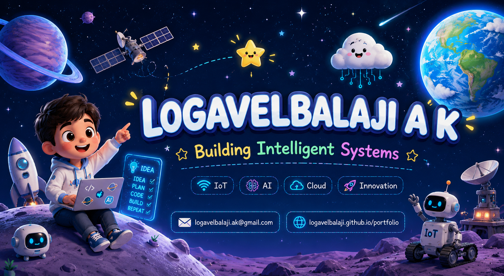

 

---

# 👋 Hey, I'm Logavelbalaji

I'm passionate about building intelligent systems that combine **IoT, Cloud, AI, and Full Stack Development** to solve real-world challenges.

💰 ₹12.5 Lakhs Government Funding
📜 Patent Filed Innovation
🇯🇵 JLPT N5 Certified
☁️ AWS Cloud Learner
🏆 Student of the Month

---

## 🚀 What I Work On

* Intelligent Systems
* IoT & Automation
* Cloud Solutions
* Enterprise Applications
* Machine Learning
* Full Stack Development

---

## ⚒️ Tech Stack

---

## 💡 Featured Work

### 🏭 IoT Warehouse Security System

Government-funded innovation integrating RFID, sensors, cloud monitoring, and automated alert systems.

### 🚚 Smart Supply Chain Platform

Focused on inventory visibility, vendor intelligence, and operational optimization.

### 🏪 ERP Management System

Inventory, billing, supplier coordination, and customer management.

### 🩺 Healthcare Prediction System

Machine learning-based prediction and risk analysis.

---

## 🏆 Highlights

* Patent Filed – IoT-Based Warehouse Security
* ₹12.5 Lakhs Government Funding
* Quantum Shields Cybersecurity Competition
* TCS CodeVita Season 13
* AI ASCEND Participant
* Student of the Month

---

## 📊 GitHub Analytics

---

## 🌐 Connect

---

